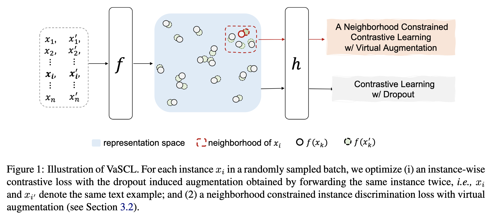

## VaSCL

This repository contains the code for our paper 
[Virtual Augmentation Supported Contrastive Learning of Sentence Representations (Findings of ACL 2022)](https://arxiv.org/pdf/2110.08552.pdf). 
Dejiao Zhang, Wei Xiao, Henghui Zhu, Xiaofei Ma, Andrew Arnold.


## Overview



### Dependencies: 
    pytorch==1.8.1+cu111 
    transformers==4.8.1
    sentence-transformers==2.0.0
    numpy==1.19.2
    sklearn==0.23.2
    tensorboardX==2.3 


### Training Data

We train our model on the data downloaded from the [SimCSE](https://github.com/princeton-nlp/SimCSE/blob/main/data/download_wiki.sh). 
We first covert the data to csv file with column name "text". We then drop the duplicated rows / training instances.

### Run VaSCL 

To run VaSCL we set <u>text1</u> = <u>text2</u> = <u>text</u> (assume <u>text</u> is the column name of training
examples), i.e., forwarding the same training instance twice. To run VaSCL with
positive pairs, set "text1" and "text2" as the assoicated column names. 

```bash
python3 main.py \
   --resdir ../results/vascl/  \
   --devset sts-b \
   --path_sts_data PATH-TO-THE-SentEval-DATA \
   --datapath PATH-TO-YOUR-PRETRAINING-DATA \
   --dataname wiki1m_unique \
   --text1 text \   # text1=text2, forwarding the same instance twice
   --text2 text \
   --bert robertabase \
   --lr 5e-06 \
   --lr_scale 100 \
   --batch_size 1024 \
   --epochs 5 \
   --max_iter 100 \
   --logging_step 500 \
   --seed 0 &
```

In the same way, you can also run VaSCL on your own datasets.


## Import VaSCL from Huggingface Model Hub
```python
from transformers import AutoModel, AutoTokenizer

# Import PairSupCon models
tokenizer = AutoTokenizer.from_pretrained("aws-ai/vascl-roberta-base")
model = AutoModel.from_pretrained("aws-ai/vascl-roberta-base")

tokenizer = AutoTokenizer.from_pretrained("aws-ai/vascl-roberta-large")
model = AutoModel.from_pretrained("aws-ai/vascl-roberta-large")
```


Contact person: [Dejiao Zhang](https://www.amazon.science/author/deijao-zhang), 
[dejiaoz@amazon.com](dejiaoz@amazon.com)


## Downstream Evaluation

We provide the evaluation code for both STS and Clustering evaluation. 
Please navigate to the "../DownstreamEval" folder and checkout the details there.

## License

This project is licensed under the Apache-2.0 License.